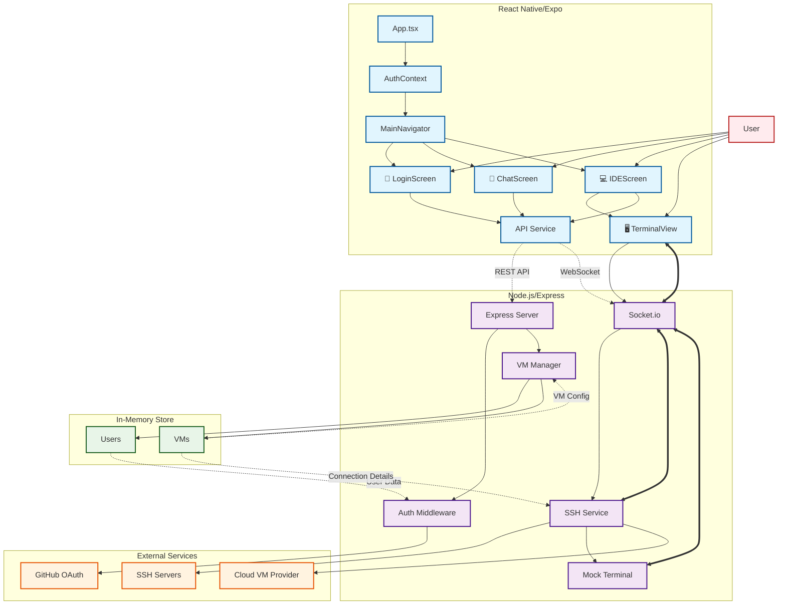

# Jules Mobile Prototype - System Architecture

## Architecture Notes

### Mobile App (React Native/Expo)
- **Tech Stack**: TypeScript, React Navigation
- **Components**: Authentication, Chat interface, VM management, Terminal view
- **Communication**: REST API for data, WebSocket for real-time terminal

### Backend Server (Node.js)
- **Tech Stack**: Express.js, Socket.io, SSH2 library
- **Features**: Authentication middleware, VM CRUD operations, SSH connections, Mock terminal
- **Storage**: In-memory data store (prototype)

### Key Features
- **Authentication**: Mock GitHub OAuth
- **VM Management**: Local and Cloud VM support with pricing tiers
- **Terminal**: Real SSH connections via Socket.io or mock terminal for testing
- **Chat**: AI assistant interface (mocked responses)